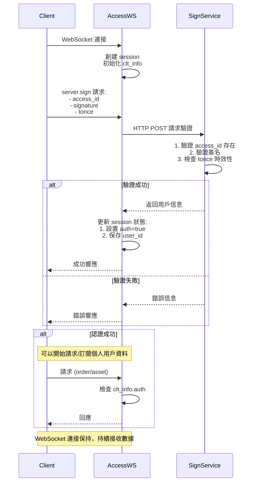
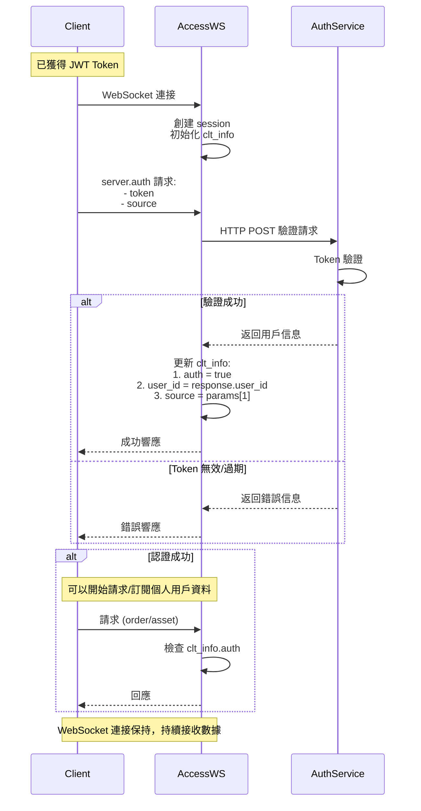

# AccessWS 服務

- [AccessWS 服務](#accessws-服務)
  - [概述](#概述)
  - [認證機制](#認證機制)
    - [1. API 認證 (server.sign)](#1-api-認證-serversign)
    - [2. 用於一般用戶通過網頁或 App 訪問認證 (server.auth)](#2-用於一般用戶通過網頁或-app-訪問認證-serverauth)
  - [處理 Kafka 資料流程圖](#處理-kafka-資料流程圖)
  - [與其他服務的 RPC 連接用途](#與其他服務的-rpc-連接用途)
    - [MarketPrice 服務連接用途](#marketprice-服務連接用途)
    - [ReadHistory 服務連接用途](#readhistory-服務連接用途)
    - [MatchEngine 服務連接用途](#matchengine-服務連接用途)
  - [記憶體緩存相關](#記憶體緩存相關)
  - [排程相關](#排程相關)

## 概述

- AccessWS 是一個基於 WebSocket 的實時數據服務，提供：
  - 市場數據實時推送
  - 用戶資產變動通知
  - 訂單狀態更新
  - 系統狀態監控

## 認證機制

### 1. API 認證 (server.sign)

- **用途**：驗證 API 訪問權限
- **調用方式**：



### 2. 用於一般用戶通過網頁或 App 訪問認證 (server.auth)

- **用途**：驗證一般用戶訪問權限
- **調用方式**：



## 處理 Kafka 資料流程圖

```mermaid
sequenceDiagram
    participant K as Kafka
    participant A as accessws
    participant ME as matchengine
    participant C as WebSocket Client

    %% 初始訂閱流程
    C->>A: asset_subscribe(user_id, ses, asset)
    Note over A: 將 client session 加入<br/>資產訂閱列表 dict_sub
    
    C->>A: order_subscribe(user_id, ses, market)
    Note over A: 將 client session 加入<br/>訂單訂閱列表 dict_sub

    %% Kafka Balance Topic 處理流程
    K->>A: Balance Message
    
    rect rgb(38, 93, 38)
        Note over A: 檢查是否有訂閱該資產
        A->>A: 創建 state_entry<br/>保存 user_id 和 asset
        A->>ME: CMD_BALANCE_QUERY
        ME-->>A: Balance Query Response
        Note over A: on_backend_recv_pkg
        A->>A: on_balance_query_reply
        A->>C: send_notify("asset.update", result)
        Note over C:  餘額變更消息
    end

    %% Kafka Order Topic 處理流程
    K->>A: Order Message( BTCUSDT )
    
    rect rgb(38, 93, 38)
        Note over A: 檢查是否有訂閱該市場
        A->>C: send_notify("order.update", params)
        Note over C: 通知客戶端訂單狀態變化
    end
    
    rect rgb(38, 93, 38)
        Note over A: 檢查是否有訂閱該資產
        A->>A: 創建 state_entry<br/>保存 user_id 和 asset
        A->>ME: CMD_BALANCE_QUERY
        ME-->>A: Balance Query Response
        Note over A: on_backend_recv_pkg
        A->>A: on_balance_query_reply
        A->>C: send_notify("asset.update", result)
        Note over C: 通知 "基準貨幣" (BTC) 餘額
    end
    
    rect rgb(38, 93, 38)
        Note over A: 檢查是否有訂閱該資產
        A->>A: 創建 state_entry<br/>保存 user_id 和 asset
        A->>ME: CMD_BALANCE_QUERY
        ME-->>A: Balance Query Response
        Note over A: on_backend_recv_pkg
        A->>A: on_balance_query_reply
        A->>C: send_notify("asset.update", result)
        Note over C: 通知 "計價貨幣" (USDT) 餘額
    end
```



## 與其他服務的 RPC 連接用途

### MarketPrice 服務連接用途

- K 線數據查詢（on_method_kline_query）: 不需授權
- 市場價格查詢（on_method_price_query）: 不需授權
- 市場狀態查詢（on_method_state_query）: 不需授權
- 今日市場數據查詢（on_method_today_query）: 不需授權
- 成交記錄查詢（on_method_deals_query）: 不需授權

### ReadHistory 服務連接用途

- 訂單歷史查詢（on_method_order_history）: 需授權
- 資產歷史查詢（on_method_asset_history）: 需授權

### MatchEngine 服務連接用途

- 深度數據查詢（on_method_depth_query）: 不需授權
- 訂單查詢（on_method_order_query）: 需授權
- 資產查詢（on_method_asset_query）: 需授權

## 記憶體緩存相關

- 訂單相關 (`aw_order.c`)
  - dict_sub: 用戶訂單訂閱管理
    - **order.subscribe** 時將所有 markets 加入訂閱清單，**order.unsubscribe** 時移除
    - Key: user_id
    - Value: list_t<sub_unit>

      ```c
      // 訂閱單元結構
      struct sub_unit {
         void *ses;                              // WebSocket session
         char market[MARKET_NAME_MAX_LEN];       // 市場名稱 (ex: BTCUSDT)
      };
      ```

- 資產相關 (`aw_asset.c`)
  - dict_sub: 用戶資產餘額訂閱管理
    - **asset.subscribe** 時將 asset 加入訂閱清單，**asset.unsubscribe** 時移除
    - Key: user_id
    - Value: list_t<sub_unit>

      ```c
      // 訂閱單元結構
      struct sub_unit {
         void *ses;                         // WebSocket session
         char asset[ASSET_NAME_MAX_LEN];    // 資產名稱 (ex: USDT, ETH, BTC...)
      };
      ```

- 成交相關 (`aw_deals.c`)
  - dict_market: 用戶成交記錄訂閱管理
    - Key: market
    - Value: market_val

      ```c
      // 市場值結構
      struct market_val {
         dict_t *sessions;    // 訂閱該市場的所有會話
         list_t *deals;       // 最近的成交記錄
         uint64_t last_id;    // 最後成交ID
      };
      ```

- resp 相關 (`aw_server.c`)
  - dict_cache
    - Key: cache_key
    - Value: json_t

- kline 相關 (`aw_kline.c`)
  - dict_kline: K 線圖資料訂閱管理
    - Key: kline_key
    - Value: kline_val

      ```c
      struct kline_key {
          char market[MARKET_NAME_MAX_LEN];
          int interval;
      };

      struct kline_val {
          dict_t *sessions;
          json_t *last;
      };
      ```

## 排程相關

- aw_kline.c
  - 每 settings.kline_interval 秒更新 K 線圖資料
  - 會調用 **marketprice** 服務的 *CMD_MARKET_KLINE* 命令並送到 client
- aw_depth.c
  - 每 settings.depth_interval 秒更新深度圖資料
  - 會調用 **matchengin** 服務的 *CMD_ORDER_BOOK_DEPTH* 命令並送到 client
- aw_deals.c
  - 每 settings.deals_interval 秒更新成交記錄
  - 會調用 **marketprice** 服務的 *CMD_MARKET_DEALS* 命令並送到 client
- aw_state.c
  - 每 settings.state_interval 秒更新市場狀態
  - 會調用 **marketprice** 服務的 *CMD_MARKET_STATUS* 命令並送到 client
- aw_server.c
  - 每 60 秒清理快取資料
- aw_today.c
  - 每 settings.today_interval 秒更新今日市場資訊
  - 會調用 **marketprice** 服務的 *CMD_MARKET_STATUS_TODAY* 命令並送到 client
- aw_main.c
  - 每 0.5 秒檢查 cron 任務
- aw_price.c
  - 每 settings.price_interval 秒更新價格資訊
  - 會調用 **marketprice** 服務的 *CMD_MARKET_LAST* 命令並送到 client