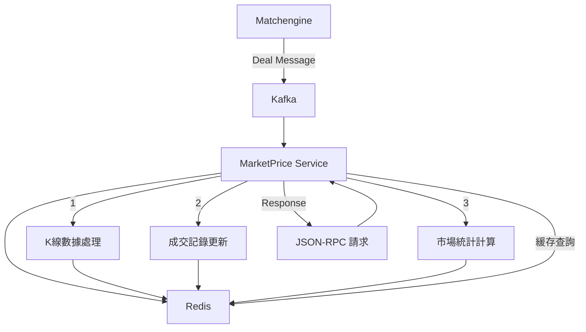

# MarketPrice 服務

- [MarketPrice 服務](marketprice.md)
  - [概述](#概述)
  - [核心功能](#核心功能)
    - [1. 市場狀態查詢 (CMD_MARKET_STATUS)](#1-市場狀態查詢-cmd_market_status)
    - [2. K線圖數據 (CMD_MARKET_KLINE)](#2-k線圖數據-cmd_market_kline)
    - [3. 最新成交記錄 (CMD_MARKET_DEALS)](#3-最新成交記錄-cmd_market_deals)
    - [4. 最新價格查詢 (CMD_MARKET_LAST)](#4-最新價格查詢-cmd_market_last)
    - [5. 今日市場統計 (CMD_MARKET_STATUS_TODAY)](#5-今日市場統計-cmd_market_status_today)
  - [處理 matchengine 訊息](#處理-matchengine-訊息)
  - [緩存機制](#緩存機制)
  - [排程相關](#排程相關)

## 概述

MarketPrice 服務負責處理和提供市場價格相關的即時數據，包括 K 線圖、成交記錄、市場統計等。



## 核心功能

### 1. 市場狀態查詢 (CMD_MARKET_STATUS)

- **功能**: 查詢指定市場的當前狀態
- **數據來源**: Redis
- **返回數據**:
  - 最新價格
  - 24小時變化
  - 24小時最高/最低
  - 24小時成交量

### 2. K線圖數據 (CMD_MARKET_KLINE)

- **功能**: 獲取不同時間週期的 K 線數據
- **支持週期**:
  - 秒級 (1s, 5s, 15s, 30s)
  - 分鐘級 (1m, 5m, 15m, 30m)
  - 小時級 (1h, 2h, 4h, 6h, 12h)
  - 日級 (1d)
  - 週級 (1w)
  - 月級 (1M)
- **數據結構**:

  ```json
  {
    "time": 1641657600,
    "open": "42000.00",
    "close": "42100.00",
    "high": "42200.00",
    "low": "41900.00",
    "volume": "100.0000",
    "deal": "4205000.00"
  }
  ```

### 3. 最新成交記錄 (CMD_MARKET_DEALS)

- **功能**: 獲取市場最新成交記錄
- **數據來源**: Redis + 實時更新
- **返回數據**:
  - 成交ID
  - 成交時間
  - 成交價格
  - 成交數量
  - 買賣方向

### 4. 最新價格查詢 (CMD_MARKET_LAST)

- **功能**: 獲取市場最新成交價格
- **數據來源**: 內存緩存
- **更新機制**: 實時更新

### 5. 今日市場統計 (CMD_MARKET_STATUS_TODAY)

- **功能**: 獲取今日市場統計數據
- **返回數據**:
  - 開盤價
  - 最高價
  - 最低價
  - 成交量
  - 成交額

## 處理 matchengine 訊息

- 作為 kafka deals topic 的 consumer

1. **訊息接收**:

```c
void on_deals_message(sds message, int64_t offset) {
    // 1. 解析交易信息
    json_t *json = json_loadb(message, sdslen(message), 0, NULL);
    // 2. 更新市場數據
    market_update(market, timestamp, price, amount, side, id);
    // 3. 更新 K 線數據
    add_update(info, KLINE_SEC, timestamp);
    add_update(info, KLINE_MIN, timestamp);
    add_update(info, KLINE_HOUR, timestamp);
    add_update(info, KLINE_DAY, timestamp);
}
```

2. **訊息存儲**:

```c
int flush_kline(redisContext *context, struct market_info *info, struct update_key *ukey) {
    // 1. 獲取 K 線數據
    dict_t *dict = get_kline_dict(info, ukey->kline_type);
    // 2. 構建 Redis key
    sds key = get_kline_key(info->name, ukey->kline_type, ukey->timestamp);
    // 3. 存儲到 Redis
    redis_zadd(context, key, ukey->timestamp, json);
}
```

## 緩存機制

1. **內存緩存**:

```c
struct market_info {
    char   *name;          // 市場名稱
    mpd_t  *last;          // 最新價格
    dict_t *sec;           // 秒級數據
    dict_t *min;           // 分鐘級數據
    dict_t *hour;          // 小時級數據
    dict_t *day;           // 日級數據
    dict_t *update;        // 更新標記
    list_t *deals;         // 最新成交
    double update_time;    // 更新時間
};
```

2. **Redis 緩存**:

- K線數據: `market:kline:{market}:{period}` (Sorted Set)
- 成交記錄: `market:deals:{market}` (List)
- 市場統計: `market:status:{market}` (Hash)

3. **緩存更新策略**:

```c
// 定時刷新到 Redis
void on_market_timer(nw_timer *timer, void *privdata) {
    int ret = flush_market();
}

// 定時清理過期數據
void on_clear_timer(nw_timer *timer, void *privdata) {
    clear_kline();
}
```

## 排程相關

- mp_message.c
  - on_market_timer
  - on_clear_timer
  - on_redis_timer
- mp_main.c
  - on_cron_check
- mp_service.c
  - on_cache_timer