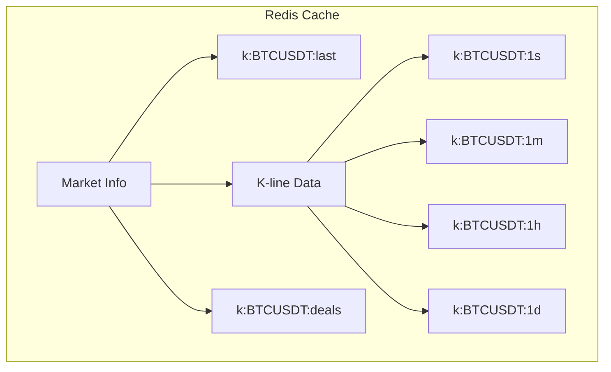
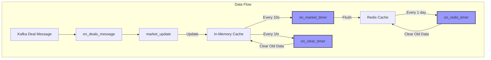

# MarketPrice 服務

- [MarketPrice 服務](marketprice.md)
  - [概述](#概述)
  - [核心功能](#核心功能)
    - [1. 市場狀態查詢 (CMD_MARKET_STATUS)](#1-市場狀態查詢-cmd_market_status)
    - [2. K線圖數據 (CMD_MARKET_KLINE)](#2-k線圖數據-cmd_market_kline)
    - [3. 最新成交記錄 (CMD_MARKET_DEALS)](#3-最新成交記錄-cmd_market_deals)
    - [4. 最新價格查詢 (CMD_MARKET_LAST)](#4-最新價格查詢-cmd_market_last)
    - [5. 今日市場統計 (CMD_MARKET_STATUS_TODAY)](#5-今日市場統計-cmd_market_status_today)
  - [處理 matchengine 訊息](#處理-matchengine-訊息)
  - [緩存機制](#緩存機制)
  - [排程相關](#排程相關)

## 概述

- MarketPrice 服務負責處理和提供市場價格相關的即時數據，包括 K 線圖、成交記錄、市場統計等。
- 服務啟動時，會把 Redis 中的數據讀取到記憶體中
- 市場數據更新流程：
  1. 通過 Kafka 接收實時成交數據
  2. 即時更新記憶體中的市場數據
  3. 每 10 秒將記憶體數據同步到 Redis 作持久化儲存
- 所有客戶端請求直接從記憶體中讀取
- 數據恢復機制：
  1. 如果服務在兩次同步之間（10秒內）崩潰，重啟後會：
     - 從 Redis 讀取最後一次同步的數據(`k:offset`)
     - 從 Kafka 重新讀取最新消息來補充期間的更新
     - 確保數據最終一致性
- marketprice 中的命令處理流程，可區分兩種流程
  - 使用 response 緩存 (CMD_MARKET_STATUS, CMD_MARKET_KLINE, CMD_MARKET_STATUS_TODAY)
  - 不使用 response 緩存 (CMD_MARKET_DEALS, CMD_MARKET_LAST)






## 核心功能

  ### 1. 市場狀態查詢 (CMD_MARKET_STATUS)

- **功能**: 查詢指定市場的統計數據
- **Function Description**: Retrieves market statistics for a specified trading pair over a custom time period. The function calculates OHLC (Open, High, Low, Close) prices, trading volume, and deal amount by aggregating individual trades over the requested period.
- If the current time is 14:30:00 and Interval input is 86400:
  - gives data from yesterday 14:30:00 to today 14:30:00
- **返回數據結構**:
  - 最新價格
  - 24小時變化
  - 24小時最高/最低
  - 24小時成交量

    ```json
    "result": {
      "period": 86400,
      "last": "20",
      "open": "0",
      "close": "20",
      "high": "20",
      "low": "0",
      "volume": "0.15",
      "deal": "3"
    }
    ```

    ```mermaid
    sequenceDiagram
        Client->>Server: market.status (market, period)
        Server->>Cache: 查詢緩存
        alt 緩存命中
            Cache-->>Server: 返回緩存
        else 緩存未命中
            Server->>Memory: 查詢並合併 sec/min 數據
            Server->>Cache: 更新緩存
        end
        Server->>Client: 返回結果
    ```

### 2. K線圖數據 (CMD_MARKET_KLINE)

- **功能**: 獲取不同時間週期的 K 線數據
- **支持週期**: 參數 interval 都是以 seconds 為單位
  - 秒級 ( `get_market_kline_sec()` ) : 支援 1s, 2s, 3s, 5s, 10s, 15s, 20s, 30s
  - 分鐘級 ( `get_market_kline_min()` ): 支援 60s(1m), 120s(2m), 180s(3m), 300s(5m), 600s(10m), 900s(15m), 1800s(30m)
  - 小時級 ( `get_market_kline_hour()` ): 1h(3600s), 2h(7200s), 4h(14400s), 6h(21600s), 12h(43200s)
  - 日級 ( `get_market_kline_day()` ): 1d(86400s), 2d(172800s), 3d(259200s), 4d(345600s), 5d(432000s), 6d(518400s), 7d(604800s)
  - 週級 ( `get_market_kline_week()` ): 1w(604800s)
  - 月級 ( `get_market_kline_month()` ): 1M(2592000s)
- **返回數據結構**:

  ```json
  "result": [
      [
          1736488800, // timestamp
          "0",        // open
          "100",      // close
          "200",      // high
          "0",        // low
          "3",        // volume
          "500",      // deal amount
          "ETHBCH"    // Market
      ],
      [
          1736492400,
          "100",
          "100",
          "100",
          "100",
          "0",
          "0",
          "ETHBCH"
      ],
      // ...
    ]
  ```

  ```mermaid
  sequenceDiagram
      Client->>Server: market.kline (market, start, end, interval)
      Server->>Cache: 查詢緩存
      alt 緩存命中
          Cache-->>Server: 返回緩存
      else 緩存未命中
          Server->>Memory: 根據 interval 選擇並查詢對應週期數據
          Note over Memory: sec/min/hour/day/week/month
          Server->>Cache: 更新緩存
      end
      Server->>Client: 返回結果
  ```

### 3. 最新成交記錄 (CMD_MARKET_DEALS)

- **功能**: 獲取市場最新成交
- **返回數據結構**:

      ```json
      "result": [
          {
              "id": 3,
              "time": 1736491908.160192, // 成交時間
              "price": "20",             // 成交價格
              "amount": "0.05",          // 成交數量
              "type": "buy"              // 買賣方向
          },
          {
              "id": 2,
              "time": 1736491901.487354,
              "price": "20",
              "amount": "0.05",
              "type": "buy"
          },
          //...
      ]
      ```

    ```mermaid
    sequenceDiagram
        Client->>Server: market.deals (market, limit, last_id)
        Note over Server: 不使用緩存
        Server->>Memory: 直接從 deals_json 獲取最新成交
        Server->>Client: 返回結果
    ```

### 4. 最新價格查詢 (CMD_MARKET_LAST)

- **功能**: 獲取市場最新成交價格
- **更新機制**: 實時更新

  ```mermaid
  sequenceDiagram
      Client->>Server: market.last (market)
      Note over Server: 不使用緩存
      Server->>Memory: 直接返回 market_info.last
      Server->>Client: 返回結果
  ```

### 5. 今日市場統計 (CMD_MARKET_STATUS_TODAY)

- **功能**: 獲取今日市場的統計數據
- **Function Description**: Provides market statistics specifically for the current trading day, combining calendar-day OHLC data with 24-hour rolling volume statistics
  - If the current time is 14:30:00:
    - OHLC(Open, High, Low, Close) data from today 00:00:00 to now
    - Volume/deal data from yesterday 14:30:00 to today 14:30:00
- **返回數據**:

    ```json
    "result":{
      "open": "0",   // 開盤價
      "last": "100", // 最新價
      "high": "200", // 最高價
      "low": "0",    // 最低價
      "volume ": "3", // 成交量
      "deal": "500"  // 成交額
    }
    ```

    ```mermaid
    sequenceDiagram
        Client->>Server: market.status_today (market)
        Server->>Cache: 查詢緩存
        alt 緩存命中
            Cache-->>Server: 返回緩存
        else 緩存未命中
            Server->>Memory: 查詢當日 K 線數據
            Server->>Cache: 更新緩存
        end
        Server->>Client: 返回結果
    ```

## 處理 matchengine 訊息

- 作為 kafka deals topic 的 consumer

1. **訊息接收**:

    ```c
    void on_deals_message(sds message, int64_t offset) {
        // 1. 解析交易信息
        json_t *json = json_loadb(message, sdslen(message), 0, NULL);
        // 2. 更新市場數據
        market_update(market, timestamp, price, amount, side, id);
        // 3. 更新 K 線數據
        add_update(info, KLINE_SEC, timestamp);
        add_update(info, KLINE_MIN, timestamp);
        add_update(info, KLINE_HOUR, timestamp);
        add_update(info, KLINE_DAY, timestamp);
    }
    ```

2. **訊息存儲**:

    ```c
    int flush_kline(redisContext *context, struct market_info *info, struct update_key *ukey) {
        // 1. 獲取 K 線數據
        dict_t *dict = get_kline_dict(info, ukey->kline_type);
        // 2. 構建 Redis key
        sds key = get_kline_key(info->name, ukey->kline_type, ukey->timestamp);
        // 3. 存儲到 Redis
        redis_zadd(context, key, ukey->timestamp, json);
    }
    ```

## 緩存機制

1. **內存緩存**:

    ```c
    struct market_info {
        char   *name;          // 市場名稱
        mpd_t  *last;          // 最新價格
        dict_t *sec;           // 秒級數據 (key: timestamp, value: kline_info)
        dict_t *min;           // 分鐘級數據 (key: timestamp, value: kline_info)
        dict_t *hour;          // 小時級數據 (key: timestamp, value: kline_info)
        dict_t *day;           // 日級數據 (key: timestamp, value: kline_info)
        dict_t *update;        // 更新標記 (key: update_key, value: NULL)
        list_t *deals;         // 最新成交 string 格式 (主要用於將數據持久化到 Redis)
        list_t *deals_json;    // 最新成交 json (用於快速響應 API 請求)
        double update_time;    // 更新時間
    };
    ```
   - dict_market
     - Key: market (sds)
     - Value: market_info (market_info)
   - dict_t
     - K線數據字典 (sec/min/hour/day)
       - Key: time_t (時間戳)
       - Value: struct kline_info

           ```c
           struct kline_info {
               mpd_t *open;    // 開盤價
               mpd_t *close;   // 收盤價
               mpd_t *high;    // 最高價
               mpd_t *low;     // 最低價
               mpd_t *volume;  // 成交量
               mpd_t *deal;    // 成交額
           }
           ```

     - update 標記字典: 是一個"待同步清單"，記錄著哪些 K 線數據需要被同步到 Redis
       - Key: update_key 

           ```c
           struct update_key {
               int kline_type;    // K線類型（秒/分/時/日）
               time_t timestamp;  // 對應的時間戳
           }
           ```

       - Value: NULL

   - list_t
     - deals 和 deals_json:

       ```json
       {
           "id": 4,                      // 交易ID
           "time": 1736492189.0142901,   // 時間戳
           "price": "200",               // 價格
           "amount": "1",                // 數量
           "type": "sell"               // 交易類型 (sell/buy)
       }
       ```

2. **Redis 緩存**:

   - K線數據: 使用 hash type, 存儲不同粒度的 K 線數據
     - `k:{market}:1s (seconds)`
     - `k:{market}:1m (minutes)`
     - `k:{market}:1h (hours)`
     - `k:{market}:1d (days)`
     - 這邊的資料格式範例：["20", "20", "20", "20", "0.05", "1"] 依序對應 `kline_info` (`kline_from_str()`, `kline_from_str()`)
   - 交易記錄: `k:{market}:deals` (List type)
   - 最新價格: `k:{market}:last` (String type)
   - kafka 最後處理到的 offset: `k:offset`  (String type)
  
## 排程相關

- mp_message.c
  - on_market_timer: 定時刷新 memory 到 Redis
  - on_clear_timer: 定時清理 memory 過期數據
  - on_redis_timer: 定時清理 redis 過期數據
- mp_main.c
  - on_cron_check
- mp_server.c
  - on_cache_timer: 定時清理 response 緩存