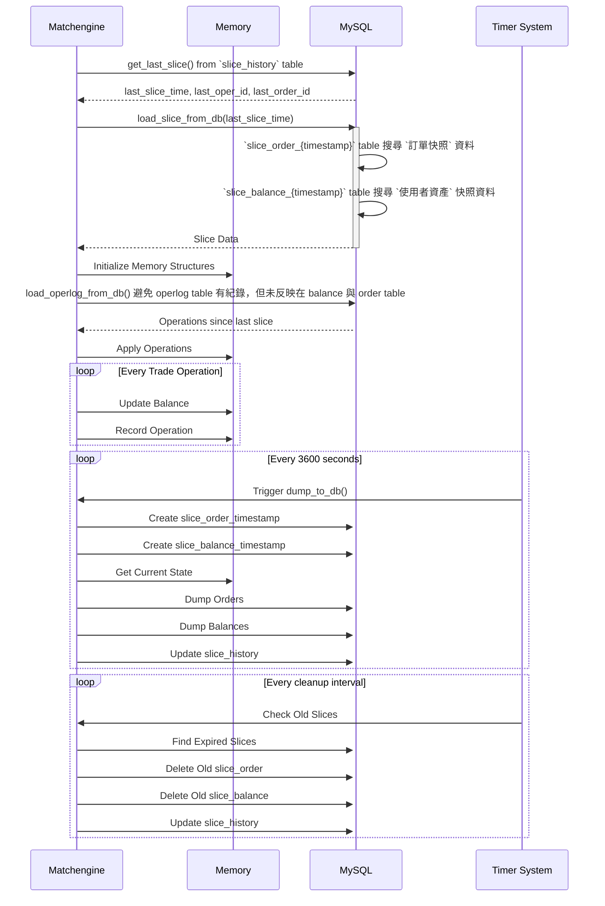

# matchengine

## 服務自訂 cli 相關

- 用來即時觀看當前記憶體 balance, market 相關資訊
  - `nc localhost 7317` ( 7317 是 matchengine 的 cli port )
    - `status`
    - `balance list`
    - `balance summary`
    - `balance get <user_id>`
    - `market summary`
    - `makeslice`

## balance 和 market 相關儲存流程

- trade_log 資料庫
  - `operlog_{YYYYMMDD}`：基於 `operlog` 樣板 table，每天建立的 table，用來記錄所有的交易操作
    - 每 0.1 秒批量記錄所有操作紀錄
  - **slice table** 相關，根據 config.json 的 *slice_interval* 的時間間隔建立的 table，並存活 *slice_keeptime* 的時間
    - `slice_order_{timestamp}` table：基於 `slice_order` 樣板 table 建立，用來記錄所有的交易訂單
    - `slice_balance_{timestamp}` table：基於 `slice_balance` 樣板 table 建立，用來記錄所有的使用者資產
  - `slice_history` table 紀錄 `slice_order_{timestamp}` 與 `slice_balance_{timestamp}` 的 timestamp，和 oper, order, deals 的 id

