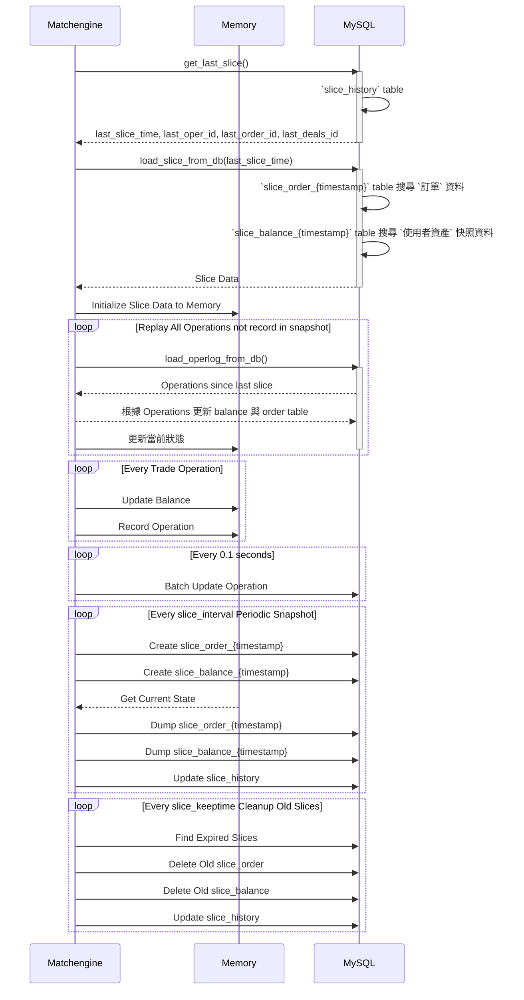
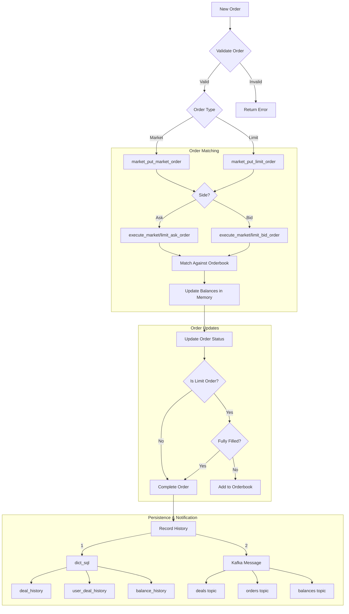
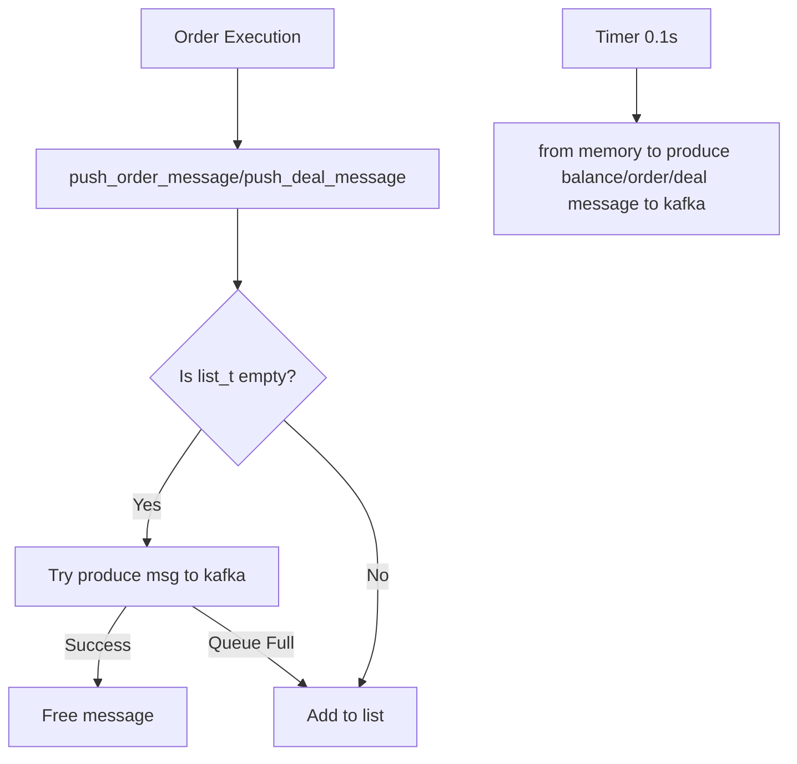

# matchengine

- [matchengine](#matchengine)
  - [服務自訂 cli 相關](#服務自訂-cli-相關)
  - [服務提供功能](#服務提供功能)
    - [使用者相關](#使用者相關)
    - [訂單交易相關](#訂單交易相關)
    - [系統相關](#系統相關)
  - [balance 和 market 相關儲存流程](#balance-和-market-相關儲存流程)
  - [記憶體相關儲存重要資料結構](#記憶體相關儲存重要資料結構)
    - [Hash Table (dict\_t)](#hash-table-dict_t)
    - [Doubly Linked List (list\_t)](#doubly-linked-list-list_t)
    - [搓和訂單](#搓和訂單)
      - [搓和流程](#搓和流程)
      - [訂單送到 DB](#訂單送到-db)
      - [訂單送到 kafka 流程](#訂單送到-kafka-流程)
  - [排程相關](#排程相關)

## 服務自訂 cli 相關

- 用來即時觀看當前記憶體 balance, market 相關資訊
  - `nc localhost 7317` ( 7317 是 matchengine 的 cli port )
    - `status`
    - `balance list`
    - `balance summary`
    - `balance get <user_id>`
    - `market summary`
    - `makeslice`

## 服務提供功能

### 使用者相關
- CMD_BALANCE_QUERY ( method: `balance.query` )：req 想顯示，根據 asset 相關設定轉換精度( prec_save -> prec_show )，將記憶體中 balance 的資訊(available, freeze)傳出去
- CMD_BALANCE_UPDATE ( method: `balance.update` )
  - [`dict_balance`](#hash-table-dict_t) 記憶體紀錄，資產訊息
  - 紀錄操作在 [`dict_update`](#hash-table-dict_t)，避免同一操作重複提交
  - 藉由 [`dict_sql`](#hash-table-dict_t) 定時紀錄到 `balance_history_{hash}`
  - 藉由 [`list`](#排程相關) 將操作依序紀錄在 `operlog_{time}`
  - 推送到 kafka (Topic: balances) 
    - 格式：`[<timestamp>, <user_id>, <asset>, <business(操作行為)>, <change>]`
- ~~CMD_BALANCE_HISTORY ( method: `balance.histoy` )~~ -> [在 readhistory 服務處理](readhistory.md#1-餘額歷史查詢-cmd_balance_history)

### 訂單交易相關
- CMD_ORDER_PUT_LIMIT ( method: `order.put_limit` )：User 下限價單
  1. 根據 ask/bid side ，決定從 [`dict_balance`](#hash-table-dict_t) 取得 base/quote asset 的 available balance，來確認餘額夠不夠
  2. 組裝 order 資訊後，根據 ask/bid side 執行不同搓合邏輯（使用 skiplist node）
    - ask limit order
      - 遞迴 skiplist 去搓合
        1. 檢查 ask order 的想交易數量是否足夠、檢查 ask price 是否 <= bid price，如果是，則進行搓合
        2. 確定成交價格以買單(maker)為準，確定交易數量(取 ask order 的想交易數量和 bid order 的想交易數量的最小值)
        3. 算出成交總金額、ask/bid order 的手續費
        4. 將 ask/bid deal record sql query ( 欲存到 `user_deal_history_{hash}`, `deal_history_{hash}`) 先暫存到 `dict_sql`
        5. 推送 deal 資訊到 kafka (Topic: deals)
        6. 更新 taker/maker order 的 left, deal_base_currency, deal_quote_currency, deal_fee，並更新記憶體 balance，將操作(包括 taker/maker fee)暫存到 `dict_update`，並後續更新 `balance_history_{hash}` 
        7. 推送 maker order(可能是 order finish/update) 到 kafka (Topic: orders)
          - {event: 3, order: {<order_info_json>, stock: <stock>, money: <money>}} (全部成交, finish)
          - {event: 2, order: {<order_info_json>, stock: <stock>, money: <money>}} (部分成交, update)
    - bid limit order
      - 遞迴 skiplist 去搓合
        1. 檢查 bid order 的想交易數量是否足夠、檢查 bid price 是否 >= ask price，如果是，則進行搓合
        2. 確定成交價格以賣單(maker)為準，確定交易數量(取 ask order 的想交易數量和 bid order 的想交易數量的最小值)
        3. 算出成交總金額、ask/bid order 的手續費
        4. 將 ask/bid deal record sql query ( 欲存到 `user_deal_history_{hash}`, `deal_history_{hash}`) 先暫存到 `dict_sql`
        5. 推送 deal 資訊到 kafka (Topic: deals)
        6. 更新 taker/maker order 的 left, deal_base_currency, deal_quote_currency, deal_fee，並更新記憶體 balance，將操作(包括 taker/maker fee)暫存到 `dict_update`，並後續更新 `balance_history_{hash}` 
        7. 推送 maker order(可能是 order finish/update) 到 kafka (Topic: orders)
          - {event: 3, order: {<order_info_json>, stock: <stock>, money: <money>}} (全部成交, finish)
          - {event: 2, order: {<order_info_json>, stock: <stock>, money: <money>}} (部分成交, update)
  3. 跟據下單是否有全部成交
    - 全部成交
      - 將 order 資料先暫存到 `dict_sql`，並後續更新 `order_history_{hash}`, `order_detail_{hash}` table
      - 將 order 資料推送到 kafka (Topic: orders) 
        - {"event": 3, "order": {<order_info_json>, stock: <stock>, money: <money>}}
    - 部分成交，剩下部分更新到 
      - 將 order 資料推送到 kafka (Topic: orders)
        - {"event": 1, "order": {<order_info_json>, stock: <stock>, money: <money>}}

- CMD_ORDER_PUT_MARKET ( method: `order.put_market` )：User 下市價單
  1. 檢查 user 的資產是否足夠、orderbook 是否有足夠訂單、檢查是否滿足最小金額
  2. 根據 ask/bid side 執行不同搓合邏輯
    - ask market order
      - 遍歷 skiplist
      - 取得成交價格、成交量(取較小的)、交易金額(price * amount)、taker/maker 手續費
      - 將 ask/bid deal record sql query ( 欲存到 `user_deal_history_{hash}`, `deal_history_{hash}`) 先暫存到 `dict_sql`
      - 推送 deal 資訊到 kafka (Topic: deals)
      - 更新 taker/maker order 的 left, deal_base_currency, deal_quote_currency, deal_fee，並更新記憶體 balance，將操作(包括 taker/maker fee)暫存到 `dict_update`，並後續更新 `balance_history_{hash}` 
      - 推送 maker order(可能是 order finish/update) 到 kafka (Topic: orders)
        - {event: 3, order: {<order_info_json>, stock: <stock>, money: <money>}} (全部成交, finish)
        - {event: 2, order: {<order_info_json>, stock: <stock>, money: <money>}} (部分成交, update)
    - bid market order
      - 遍歷 skiplist
      - 初始計算 base asset amount，按精度調整後，在回去乘上當前價格，並執行精度調整後的校驗(除法可能會產生更多小數，防止超過預算)
      - 取得成交價格、成交量(取較小的)、交易金額(price * amount)、taker/maker 手續費
      - 將 ask/bid deal record sql query ( 欲存到 `user_deal_history_{hash}`, `deal_history_{hash}`) 先暫存到 `dict_sql`
      - 推送 deal 資訊到 kafka (Topic: deals)
      - 更新 taker/maker order 的 left, deal_base_currency, deal_quote_currency, deal_fee，並更新記憶體 balance，將操作(包括 taker/maker fee)暫存到 `dict_update`，並後續更新 `balance_history_{hash}` 
      - 推送 maker order(可能是 order finish/update) 到 kafka (Topic: orders)
        - {event: 3, order: {<order_info_json>, stock: <stock>, money: <money>}} (全部成交, finish)
        - {event: 2, order: {<order_info_json>, stock: <stock>, money: <money>}} (部分成交, update)
- CMD_ORDER_CANCEL ( method: `order.cancel` )：User 取消訂單
  - 推送 order cancel 資訊到 kafka (Topic: orders)
    - {event: 3, order: {<order_info_json>, stock: <stock>, money: <money>}} (取消訂單, finish)
    - 將 orderbook(skiplist) bid/ask 訂單資訊、unfreeze base/quote asset、delete order from the `orders dictionary`(orderID -> order)、delete order from the `user order dictionary`(userID -> user_orders_skiplist)
  - 如果要 cancel 那單有被部分成交，則將 order 資料先暫存到 `dict_sql`，並後續更新 `order_history_{hash}`, `order_detail_{hash}` table
- CMD_ORDER_BOOK ( method: `order.book` )：當前 Orderbook 所有訂單詳細資訊
  - offset 不能超過 101
- CMD_ORDER_BOOK_DEPTH ( method: `order.depth` )：Orderbook 深度 (買賣單不同價錢的數量，會整合相同價錢的數量)
  - cache timeout: 預設 0.45 秒，可在 config 配置，性能與準確性做平衡
  - ex: 
    - 假設設定 price interval = 10（以 USDT 為例）：
      - 賣單(asks):
        - 價格: 15.2, 數量: 1.0
        - 價格: 16.7, 數量: 2.0
        - 價格: 23.4, 數量: 1.5
        - 價格: 26.8, 數量: 0.5
        - 價格: 32.1, 數量: 3.0
      - 買單(bids):
        - 價格: 14.8, 數量: 2.0
        - 價格: 12.3, 數量: 1.0
        - 價格: 9.7,  數量: 0.5
        - 價格: 22.5, 數量: 2.5
        - 價格: 21.9, 數量: 1.5
      - Aggregated by 10 (即每 10 USDT 為一區間)：
        ```json
        {
          "asks": [
            ["20", "3.0"],  // 價格 15.2 和 16.7 的訂單合併
            ["30", "2.0"],  // 價格 23.4 和 26.8 的訂單合併
            ["40", "3.0"]   // 價格 32.1 的訂單
          ],
          "bids": [
            ["20", "4.0"],  // 價格 22.5 和 21.9 的訂單合併
            ["10", "3.0"],  // 價格 14.8 和 12.3 的訂單合併
            ["0", "0.5"]    // 價格9.7的訂單
          ]
        }
        ```
- CMD_ORDER_QUERY ( method: `order.pending` )：查詢指定 User 所有未完成的訂單詳細資訊
- CMD_ORDER_DETAIL ( method: `order.pending_detail` )：查詢指定 User 某個未完成的訂單的交易詳情 (取得 CMD_ORDER_QUERY 的單一訂單)

### 系統相關
- CMD_ASSET_LIST ( method: `asset.list` )
  - 列出所有 asset 資訊 (暫時來自 cfg )
  - name, prec
- CMD_ASSET_SUMMARY ( method: `asset.summary` )
  - 系統所有 asset 詳細資訊 
  - name, total_balance(所有 user 資產總和), available_count(所有 user **可用**資產數量), available_balance(所有 user **可用**資產總和), freeze_count(所有 user **凍結**資產數量), freeze_balance(所有 user **凍結**資產總和)
- CMD_MARKET_LIST ( method: `market.list` )
  -  列出所有 market 資訊 (暫時來自 cfg )
  - name, stock(基礎貨幣), money(報價貨幣), fee_prec(手續費精度), stock_prec(基礎貨幣精度), money_prec(報價貨幣精度), min_amount(最小交易量)
- CMD_MARKET_SUMMARY ( method: `market.summary` )
  - 系統所有 market 詳細資訊
  - name, ask_count（掛了幾筆賣單）, ask_amount（賣單總共賣多少幣）, bid_count（掛了幾筆買單）, bid_amount（買單總共要買多少幣）


## balance 和 market 相關儲存流程

- trade_log 資料庫
  - `operlog_{YYYYMMDD}`：基於 `operlog` 樣板 table，每天建立的 table，用來記錄所有的交易操作
    - 每 0.1 秒批量記錄所有操作紀錄
  - **slice table** 相關，根據 config.json 的 *slice_interval* 的時間間隔建立的 table，並存活 *slice_keeptime* 的時間
    - `slice_order_{timestamp}` table：基於 `slice_order` 樣板 table 建立，用來記錄所有的交易訂單
    - `slice_balance_{timestamp}` table：基於 `slice_balance` 樣板 table 建立，用來記錄所有的使用者資產
  - `slice_history` table 紀錄 `slice_order_{timestamp}` 與 `slice_balance_{timestamp}` 的 timestamp，和 oper, order, deals 的 id



## 記憶體相關儲存重要資料結構

### Hash Table (dict_t)

- **dict_balance** ( `me_balance.c` )：記錄每個帳戶的餘額
  - Key: {user_id, type, asset}
  - Value: *mpd_t* (decimal balance amount)
- **dict_asset** ( `me_balance.c` )：記錄幣種資訊
  - Key: asset name *string* ( ex: BTC )
  - Value: struct *asset_type* ( asset configuration，來自 config.json 的 assets )
- **dict_market** ( `me_trade.c` )：記錄市場交易對
  - Key: market name *string* ( ex: BTCETH )
  - Value: struct *market_t*  ( market configuration，來自 config.json 的 markets )
- **dict_cache** ( `me_cache.c` )：RPC response cache
  - Key: cache key *string*
  - Value: cached response data
- **dict_sql** ( `me_history.c` )：SQL query cache 
  - Key: struct *dict_sql_key* {type, hash}
  - Value: SQL query *string*
- **dict_update** ( `me_update.c` )：記錄近 24 hr 操作行為，避免重複操作（暫時覺得有點多餘，只在初始化和使用者於無變動時，會用到）
  - Key: {user_id, asset, business, business_id}
  - Value: struct *update_val*  {create_time(double)}

### Doubly Linked List (list_t)
- kafka 送失敗相關，並有 [on_timer](#排程相關) 每 0.1s 執行一次
  - **list_deals**: 記錄送到 kafka 失敗的交易紀錄
  - **list_orders**: 記錄送到 kafka 失敗的訂單紀錄
  - **list_balances**: 記錄送到 kafka 失敗的使用者資產
- operation 相關
  - **list_t**：紀錄操作紀錄，並有 [on_timer](#排程相關) 每 0.1s 執行一次

### 搓和訂單

- **market_t** ( `me_market.h` )：也就是訂單簿(orderbook)，以利於搓和訂單
- market order (市價單)
  - 市價單從不儲存在訂單簿中
  - 它們會立即與現有的限價單進行撮合執行
  - 如果無法完全成交，剩餘的部分將被取消
- limit order (限價單)
  - 當未完全成交時，會儲存在訂單簿中
  - 按照價格和時間優先順序排序
  - 會一直留在訂單簿中，直到以下情況發生：
    - 被後續的訂單完全撮合成交
    - 被用戶取消
    - 到期（如果設定了到期時間）

#### 搓和流程



#### 訂單送到 DB

- 存訂單資訊的 sql 會先存到 dict_sql
- 每 0.1 秒執行 dict_sql 儲存的 sql
- 資料表介紹
  - deal_history: 記錄訂單級別的(order_id 索引)成交歷史
  - user_deal_history: 記錄用戶級別(user_deal_history 的 user_id + market 索引)的成交歷史
  - balance_history: 記錄用戶不同資產紀錄 

#### 訂單送到 kafka 流程

- list_t 是用來暫存無法立即送到 kafka 的資料



- kafka produce deal message ( consumer 在 [marketprice 處理並存到記憶體 market_info.deals](marketprice.md#緩存機制) )

    ```json
    [
        1736492189.0142901,  // [0] 時間戳
        "ETHBCH",            // [1] 市場名稱
        11,                  // [2] ask order id
        10,                  // [3] bid order id
        2,                   // [4] ask user id
        1,                   // [5] bid user id
        "200.00000000",      // [6] 價格
        "1.00000000",        // [7] 數量
        "0.4",               // [8] ask fee (賣方手續費)
        "0.001",             // [9] bid fee (買方手續費)
        1,                   // [10] side (1: sell, 2: buy)
        4,                   // [11] deal id
        "ETH",              // [12] 基準貨幣
        "BCH"               // [13] 計價貨幣
    ]
    ```

## 排程相關

- me_history.c
  - 每 0.1 秒執行 dict_sql 儲存的 sql
- me_main.c
  - 每 0.5 秒將 log 從 buffer 轉存到電腦
- me_message.c
  - 每 0.1 秒將 list_deals, list_orders, list_balances 資料推到 kafka
- me_operlog.c
  - 每 0.1 秒批量更新所有操作紀錄從記憶體( list_t 為 doubly linked list )到 db
    - balance.update 會用到
- me_persist.c
  - 每 1 秒檢查是否要 snapshot 記憶體 **訂單** (skiplist_t 結構), **使用者資產**(dict_balance) 資訊（更新到 `slice_order_{timestamp}`, `slice_balance_{timestamp}`, `slice_history`）
- me_server.c
  - 每 60 秒清空 dict_cache
- me_update.c
  - 每 60 秒檢查 dict_update 資料是否超過 24 hr，如果超過就刪除
