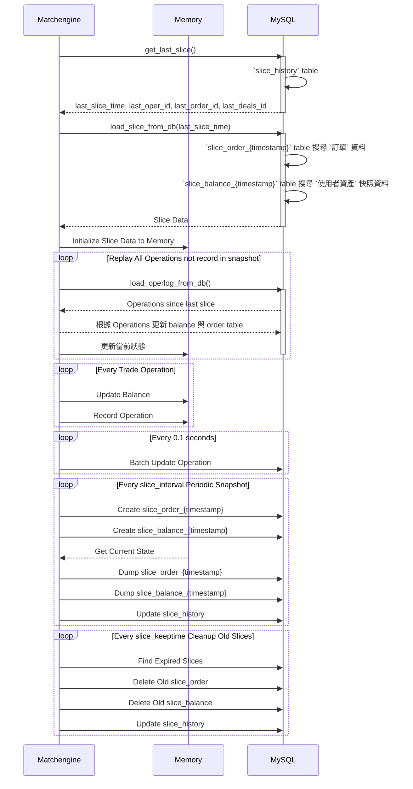

# matchengine

- [matchengine](#matchengine)
  - [服務自訂 cli 相關](#服務自訂-cli-相關)
  - [balance 和 market 相關儲存流程](#balance-和-market-相關儲存流程)
  - [記憶體相關儲存](#記憶體相關儲存)
  - [排程相關](#排程相關)

## 服務自訂 cli 相關

- 用來即時觀看當前記憶體 balance, market 相關資訊
  - `nc localhost 7317` ( 7317 是 matchengine 的 cli port )
    - `status`
    - `balance list`
    - `balance summary`
    - `balance get <user_id>`
    - `market summary`
    - `makeslice`

## balance 和 market 相關儲存流程

- trade_log 資料庫
  - `operlog_{YYYYMMDD}`：基於 `operlog` 樣板 table，每天建立的 table，用來記錄所有的交易操作
    - 每 0.1 秒批量記錄所有操作紀錄
  - **slice table** 相關，根據 config.json 的 *slice_interval* 的時間間隔建立的 table，並存活 *slice_keeptime* 的時間
    - `slice_order_{timestamp}` table：基於 `slice_order` 樣板 table 建立，用來記錄所有的交易訂單
    - `slice_balance_{timestamp}` table：基於 `slice_balance` 樣板 table 建立，用來記錄所有的使用者資產
  - `slice_history` table 紀錄 `slice_order_{timestamp}` 與 `slice_balance_{timestamp}` 的 timestamp，和 oper, order, deals 的 id

## 記憶體相關儲存

- **dict_balance** ( `me_balance.c` )：記錄每個帳戶的餘額
  - Key: {user_id, type, asset}
  - Value: *mpd_t* (decimal balance amount)
- **dict_asset** ( `me_balance.c` )：記錄幣種資訊
  - Key: asset name *string* ( ex: BTC )
  - Value: struct *asset_type* ( asset configuration，來自 config.json 的 assets )
- **dict_market** ( `me_trade.c` )：記錄市場交易對
  - Key: market name *string* ( ex: BTCETH )
  - Value: struct *market_t*  ( market configuration，來自 config.json 的 markets )
- **dict_cache** ( `me_cache.c` )：RPC response cache
  - Key: cache key *string*
  - Value: cached response data
- **dict_sql** ( `me_history.c` )：記錄每個帳戶的餘額
  - Key: struct *dict_sql_key* {type, hash}
  - Value: SQL query *string*
- **dict_update** ( `me_update.c` )：記錄近 24 hr 操作行為，避免重複操作（暫時覺得有點多餘，只在初始化和使用者於無變動時，會用到）
  - Key: {user_id, asset, business, business_id}
  - Value: struct *update_val* {create_time}

## 排程相關

