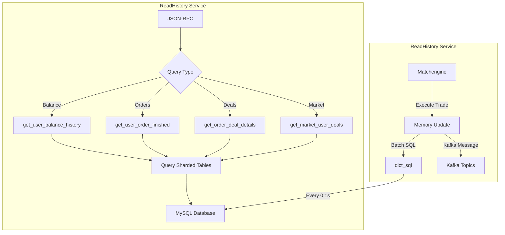

# ReadHistory 服務

- [ReadHistory 服務](readhistory.md)
  - [概述](#概述)
  - [核心功能與資料庫對應](#核心功能與資料庫對應)
    - [餘額歷史查詢 (CMD_BALANCE_HISTORY)](#1-餘額歷史查詢-cmd_balance_history)
    - [訂單歷史查詢 (CMD_ORDER_HISTORY)](#2-訂單歷史查詢-cmd_order_history)
    - [訂單成交明細查詢 (CMD_ORDER_DEALS)](#3-訂單成交明細查詢-cmd_order_deals)
    - [訂單詳情查詢 (CMD_ORDER_DETAIL_FINISHED)](#4-訂單詳情查詢-cmd_order_detail_finished)
    - [市場成交查詢 (CMD_MARKET_USER_DEALS)](#5-市場成交查詢-cmd_market_user_deals)
  - [查詢優化](#查詢優化)
    - [1. 分頁查詢實現](#1-分頁查詢實現)
    - [2. 時間範圍過濾](#2-時間範圍過濾)
    - [3. 分表策略](#3-分表策略)
    - [4. 索引優化](#4-索引優化)

## 概述

ReadHistory 服務負責從 MySQL 資料庫中查詢歷史交易數據。



## 核心功能與資料庫對應

### 1. 餘額歷史查詢 (CMD_BALANCE_HISTORY)

- **功能**: 查詢用戶的餘額變動記錄
- **查詢表**: `balance_history_{hash}`
- **分表策略**: `hash = user_id % HISTORY_HASH_NUM`
- **索引使用**: 
  - `idx_user_asset` (user_id, asset)
  - `idx_user_asset_business` (user_id, asset, business)
- **支持過濾**:
  - 資產類型 (asset)
  - 業務類型 (business)
  - 時間範圍
- **返回字段**: time, asset, business, change, balance, detail

### 2. 訂單歷史查詢 (CMD_ORDER_HISTORY)

- **功能**: 查詢用戶的已完成訂單
- **查詢表**: `order_history_{hash}`
- **分表策略**: `hash = user_id % HISTORY_HASH_NUM`
- **索引使用**: `idx_user_market` (user_id, market)
- **支持過濾**:
  - 市場 (如 BTC/USDT)
  - 買賣方向
  - 時間範圍
- **返回字段**: 訂單詳情，包括手續費和執行信息

### 3. 訂單成交明細查詢 (CMD_ORDER_DEALS)

- **功能**: 查詢訂單的所有成交記錄
- **查詢表**: `deal_history_{hash}`
- **分表策略**: `hash = order_id % HISTORY_HASH_NUM`
- **索引使用**: `idx_order_id` (order_id)
- **返回字段**: 時間、價格、數量、角色(maker/taker)

### 4. 訂單詳情查詢 (CMD_ORDER_DETAIL_FINISHED)

- **功能**: 查詢單個訂單的完整信息
- **查詢表**: `order_detail_{hash}`
- **分表策略**: `hash = order_id % HISTORY_HASH_NUM`
- **索引使用**: `idx_user_market` (user_id, market)
- **返回字段**: 
  - 基本信息：id, ctime, ftime, user_id, market
  - 訂單信息：type, side, price, amount
  - 成交信息：deal_stock, deal_money, deal_fee

### 5. 市場成交查詢 (CMD_MARKET_USER_DEALS)

- **功能**: 查詢用戶在特定市場的成交記錄
- **查詢表**: `user_deal_history_{hash}`
- **分表策略**: `hash = user_id % HISTORY_HASH_NUM`
- **索引使用**: `idx_user_market` (user_id, market)
- **返回字段**: 完整的成交信息

## 查詢優化

### 1. 分頁查詢實現

```c
// 支持 offset 和 limit
if (offset) {
    sql = sdscatprintf(sql, " LIMIT %zu, %zu", offset, limit);
} else {
    sql = sdscatprintf(sql, " LIMIT %zu", limit);
}
```

### 2. 時間範圍過濾

```c
if (start_time) {
    sql = sdscatprintf(sql, " AND `time` >= %"PRIu64, start_time);
}
if (end_time) {
    sql = sdscatprintf(sql, " AND `time` < %"PRIu64, end_time);
}
```

### 3. 分表策略

- 按用戶ID分表: `user_id % HISTORY_HASH_NUM`
- 按訂單ID分表: `order_id % HISTORY_HASH_NUM`
- 優點：
  - 提高高頻用戶查詢性能
  - 分散數據庫負載
  - 便於水平擴展

### 4. 索引優化

- 每個表都有針對性的複合索引
- 查詢條件符合最左前綴原則
- 主要索引：
  - `idx_user_market`: 用戶市場查詢
  - `idx_user_asset`: 餘額查詢
  - `idx_order_id`: 訂單明細查詢
